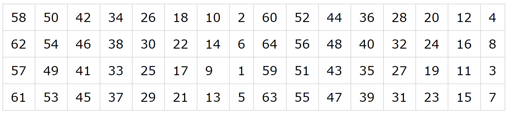
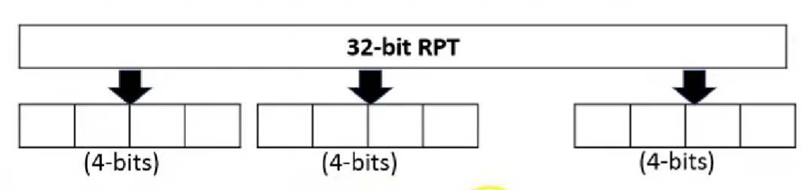
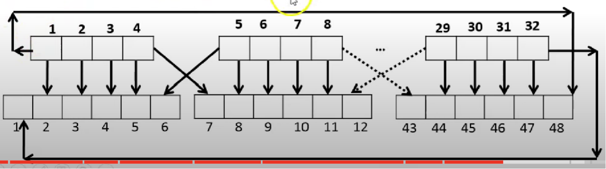
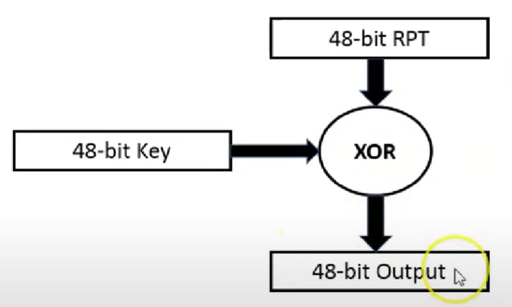
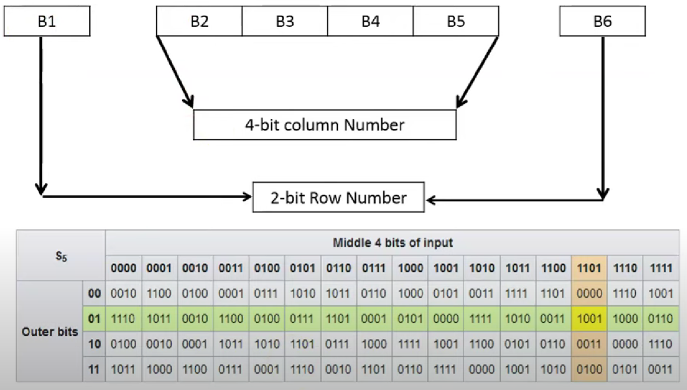
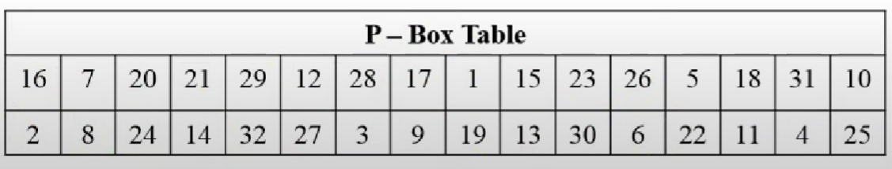
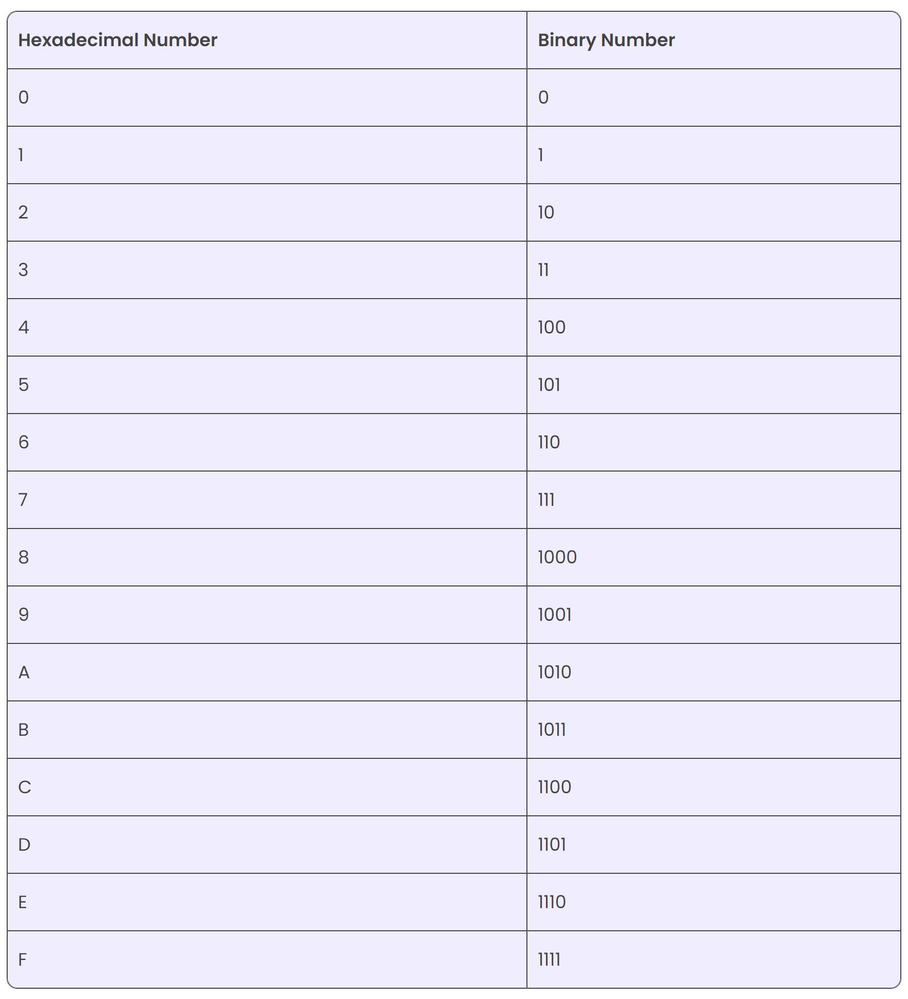

# DES_Keamanan Informasi

| Nama | NRP |
|------------------------|------------|
|Syarifah Talitha Erfany | 5025211175 |

## Daftar Isi
- [Opening](#opening)
- [Code](#Code)
- [Reference](#Reference)

## Opening


ada 2 input, yaitu 56-bit key dan 64-bit plain text

### Key Discarding Process


Setiap bit ke 8 dari original key itu bakal dihapuskan dan itu akan menghasilkan 56-bit key

### Steps of DES


1. 64-bit plain text diberikan ke inisial permutasi (IP)



Bit ke 58 dari original plaintext block bakal menulis ulang isi dari block pertama posisi bit

Bit ke 1 dari original plaintext bakal menulis ulang isi dari block 40 posisi bit

2. IP terbagi 2 blok permutasi menjadi Left Plain Text (LPT) dan Right Plain Text (RPT)
3. LPT dsn RPT akan menghasilkan 16-round proses enkripsi
4. LPT dan RPT akan bergabung kembali dan menghasilkan blok yang tergabung
5. 64-bit cipher text blok telah tergenerasi

### 16 Rounds of Encryption

1. **Key transformation (56-bit key)**
- tiap key dipecah jadi 2, masing-masing 28-bits 
- Shifting posisi bit itu tergantung dari round-nya


- Compression Permutation
    - 56-bit input dengan shifting posisi bit
    - Menghasilkan 48-bit key

2. **Expansion Permutation dari plain text dan XOR**
- 32-bit RPT di expand jadi 48-bit karena bit yang lain 48-bit
- Steps :
    - 32-bit RPT dibagi menjadi 8-block yang masing-masing berisi 4-bit


    - Lalu setiap 4-bit block diexpand lagi menjadi 6-bit tiap block

    
    - 48-bit RPT di XORkan dengan 48-bit key dan outputnya diberikan ke S-box


3. **S-box substitution**
- Mengconvert lagi dari 48-bit RPT jadi 32-bit karena LPT nya masih 32-bit
- Steps :
    - Misalkan hasil dari XOR adalah 011011, karena diambil 4-bit di tengah sehingga fokus di 1001, sedangkan 2-bit di depan dan belakang menyatu


4. **P-box (permutation)**
- Output dari S-box itu dikasih ke P-box
- 32-bit dipermutasikan dengan 16 x 2 tabel permutasi


5. **XOR dan swap**
- 32-bit LPT di XOR dengan 32-bit P-box


Round pertama sudah selesai

6. **Final Permutation**
- FP hanya terjadi sekali setelah 16 round
- Outputnya adalah 64-bit block yang telah di enkripsi

## Code
```
def hex2bin(s):
	mp = {'0': "0000",
		'1': "0001",
		'2': "0010",
		'3': "0011",
		'4': "0100",
		'5': "0101",
		'6': "0110",
		'7': "0111",
		'8': "1000",
		'9': "1001",
		'A': "1010",
		'B': "1011",
		'C': "1100",
		'D': "1101",
		'E': "1110",
		'F': "1111"}
	bin = ""
	for i in range(len(s)):
		bin = bin + mp[s[i]]
	return bin
```
Dibuat fungsi library `hex2bin` dengan parameter `s` yang berguna untuk ngeconvert hexadesimal menjadi binary



---

```
def bin2hex(s):
	mp = {"0000": '0',
		"0001": '1',
		"0010": '2',
		"0011": '3',
		"0100": '4',
		"0101": '5',
		"0110": '6',
		"0111": '7',
		"1000": '8',
		"1001": '9',
		"1010": 'A',
		"1011": 'B',
		"1100": 'C',
		"1101": 'D',
		"1110": 'E',
		"1111": 'F'}
	hex = ""
	for i in range(0, len(s), 4):
		ch = ""
		ch = ch + s[i]
		ch = ch + s[i + 1]
		ch = ch + s[i + 2]
		ch = ch + s[i + 3]
		hex = hex + mp[ch]

	return hex
```
Dibuat fungsi library `bin2hex` dengan parameter `s` yang berguna untuk ngeconvert binary menjadi hexadesimal

---

```
def bin2dec(binary):

	binary1 = binary
	decimal, i, n = 0, 0, 0
	while(binary != 0):
		dec = binary % 10
		decimal = decimal + dec * pow(2, i)
		binary = binary//10
		i += 1
	return decimal
```
Fungsi `bin2dec` dengan parameter `binary` untuk mengubah dari binary ke desimal

`binary1` menyimpan salinan dari `binary` karena nilainya akan terus diubah selama proses konversi

---

```
def dec2bin(num):
	res = bin(num).replace("0b", "")
	if(len(res) % 4 != 0):
		div = len(res) / 4
		div = int(div)
		counter = (4 * (div + 1)) - len(res)
		for i in range(0, counter):
			res = '0' + res
	return res
```
Fungsi `dec2bin` dengan parameter `num` untuk mengubah dari desimal ke binary

`res = bin(num).replace("0b", ""):`

Fungsi `bin(num)` mengonversi bilangan desimal `num` ke representasi binernya

`Metode replace("0b", "")` digunakan untuk menghapus awalan "0b" yang muncul dalam representasi biner yang dihasilkan oleh fungsi `bin()`.

`if(len(res) % 4 != 0):` = mengecek apakah panjang string binernya tidak habis dibagi oleh 4

`counter = (4 * (div + 1)) - len(res)` = selisih antara panjang string biner setelah penambahan digit 0 dan panjang string biner awal (sebelum penambahan digit 0)

---

```
def permute(k, arr, n):
	permutation = ""
	for i in range(0, n):
		permutation = permutation + k[arr[i] - 1]
	return permutation
```
Fungsi `permute` dengan parameter `k` sebagai input, `arr` sebagai urutan permutasi, dan `n` sebagai panjang array untuk menghitung permutasi

`k[arr[i] - 1]` = melakukan permutasi pada input `k`
`[arr[i] - 1]`  digunakan karena indeks dalam pemrograman dimulai dari 0, sedangkan dalam konteks permutasi, indeks dimulai dari 1.

---

```
def shift_left(k, nth_shifts):
	s = ""
	for i in range(nth_shifts):
		for j in range(1, len(k)):
			s = s + k[j]
		s = s + k[0]
		k = s
		s = ""
	return k
```
## Reference

https://www.geeksforgeeks.org/data-encryption-standard-des-set-1/

https://byjus.com/maths/convert-hexadecimal-to-binary/

https://www.youtube.com/watch?v=cVhlCzmb-v0&ab_channel=ChiragBhalodia

https://www.tutorialspoint.com/what-is-initial-permutation-in-des

https://www.rapidtables.com/convert/number/binary-to-decimal.html