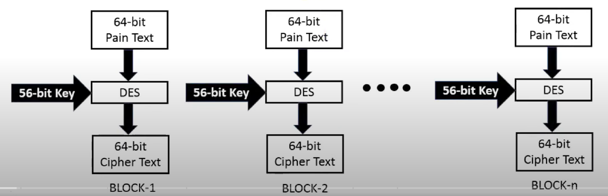

# DES_Keamanan Informasi

| Nama | NRP |
|------------------------|------------|
|Syarifah Talitha Erfany | 5025211175 |

## Daftar Isi
- [Opening](#opening)
- [Code](#kode)
  - [Script 01](#Script-01)
  - [Explanation 01](#Explanation-01)
  - [Script 02](#Script-01)
  - [Explanation 02](#Explanation-01)
- [Reference](#Referensi)

## Opening



## Code
### Script 01
```
const CryptoJS = require('crypto-js');
const readlineSync = require('readline-sync');
```

### Explanation 01
Berikut adalah library yang diperlukan dalam penyusunan kode DES. 
1. `const readlineSync = require('readline-sync');` = untuk mengambil input user
2. `const CryptoJS = require('crypto-js');` = library javascript buat standar crypto

### Script 02
```
class DES {
    constructor(key) {
        // Initialize DES with key
        this.key = CryptoJS.enc.Hex.parse(key);
    }

    encrypt(userInput) {
        // Perform DES encryption on plaintext
        const encrypted = CryptoJS.DES.encrypt(
            userInput,
            this.key,
            { mode: CryptoJS.mode.ECB }
        );

        // Return ciphertext as hex string
        return encrypted.ciphertext.toString();
    }

    decrypt(ciphertext) {
        // Parse ciphertext from hex string
        const ciphertextHex = CryptoJS.enc.Hex.parse(ciphertext);

        // Perform DES decryption on ciphertext
        const decrypted = CryptoJS.DES.decrypt(
            { ciphertext: ciphertextHex },
            this.key,
            { mode: CryptoJS.mode.ECB }
        );

        // Return decrypted plaintext as UTF-8 string
        return decrypted.toString(CryptoJS.enc.Utf8);
    }
}
```

### Explanation 02
Berikut adalah library yang diperlukan dalam penyusunan kode DES. 
1. `const readlineSync = require('readline-sync');` = untuk mengambil input user
2. `const CryptoJS = require('crypto-js');` = library javascript buat standar crypto

## Reference
```
https://www.geeksforgeeks.org/data-encryption-standard-des-set-1/
```