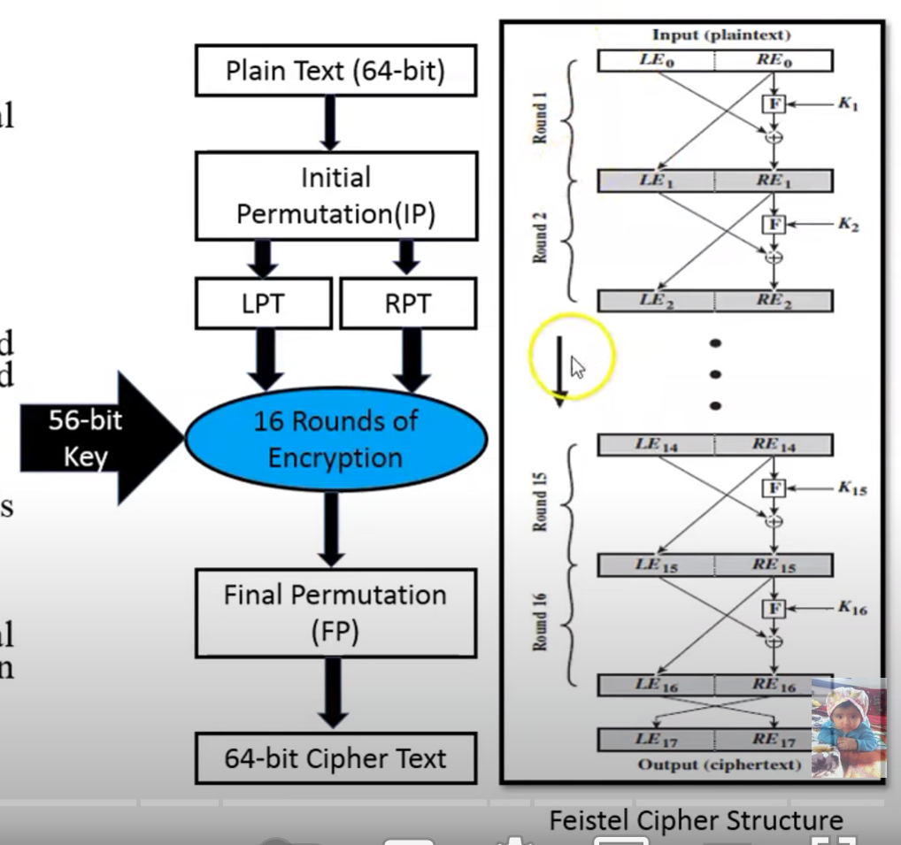
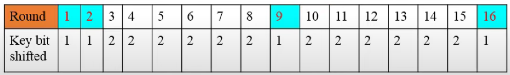

# DES_Keamanan Informasi

| Nama | NRP |
|------------------------|------------|
|Syarifah Talitha Erfany | 5025211175 |

## Daftar Isi
- [Opening](#opening)
- [Code](#kode)
- [Reference](#Referensi)

## Opening


ada 2 input, yaitu 56-bit key dan 64-bit plain text

### Key Discarding Process


Setiap bit ke 8 dari original key itu bakal dihapuskan dan itu akan menghasilkan 56-bit key

### Steps of DES



1. 64-bit plain text diberikan ke inisial permutasi (IP)
2. IP terbagi 2 blok permutasi menjadi Left Plain Text (LPT) dan Right Plain Text (RPT)
3. LPT dsn RPT akan menghasilkan 16-round proses enkripsi
4. LPT dan RPT akan bergabung kembali dan menghasilkan blok yang tergabung
5. 64-bit cipher text blok telah tergenerasi

### 16 Rounds of Encryption

1. Key transformation (56-bit key)
- tiap key dipecah jadi 2, masing-masing 28-bits 
- Shifting posisi bit itu tergantung dari round-nya


2. Compression Permutation
- 


3. Expansion Permutation dari plain text dan XOR 
4. S-box substitution
5. P-box (permutation)
6. XOR dan swap


## Code
```
const CryptoJS = require('crypto-js');
const readlineSync = require('readline-sync');
```
Berikut adalah library yang diperlukan dalam penyusunan kode DES. 
1. `const readlineSync = require('readline-sync');` = untuk mengambil input user
2. `const CryptoJS = require('crypto-js');` = library javascript buat standar crypto

```
class DES {
    constructor(key) {
        // Initialize DES with key
        this.key = CryptoJS.enc.Hex.parse(key);
    }
```

Dibuat fungsi `class` DES
1. `constructor(key)` = membuat constructor untuk key nanti
2. `this.key = CryptoJS.enc.Hex.parse(key);` = key yang tadi di-refer dan diparse menggunakan fungsi dari library `CryptoJS`

```
    encrypt(userInput) {
        // Perform DES encryption on plaintext
        const encrypted = CryptoJS.DES.encrypt(
            userInput,
            this.key,
            { mode: CryptoJS.mode.ECB }
        );

        // Return ciphertext as hex string
        return encrypted.ciphertext.toString();
    }
```

Lalu ada fungsi `encrypt` yang mengambil data dari `userInput`
1. `const encrypted = CryptoJS.DES.encrypt` = mendeklarasikan variabel
2. `userInput`, `this.key`, `{ mode: CryptoJS.mode.ECB }` = variabel yang akan dienkripsi, berisi key dari enkripsi, dan mendeskripsikan mode enkripsi yang dipakai
3. `return encrypted.ciphertext.toString();` = nilai hasil enkripsinya dikembalikan dalam bentuk hex string


## Reference
```
https://www.geeksforgeeks.org/data-encryption-standard-des-set-1/
```