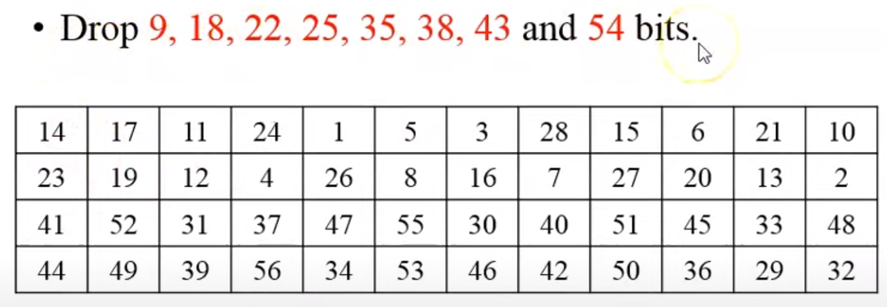
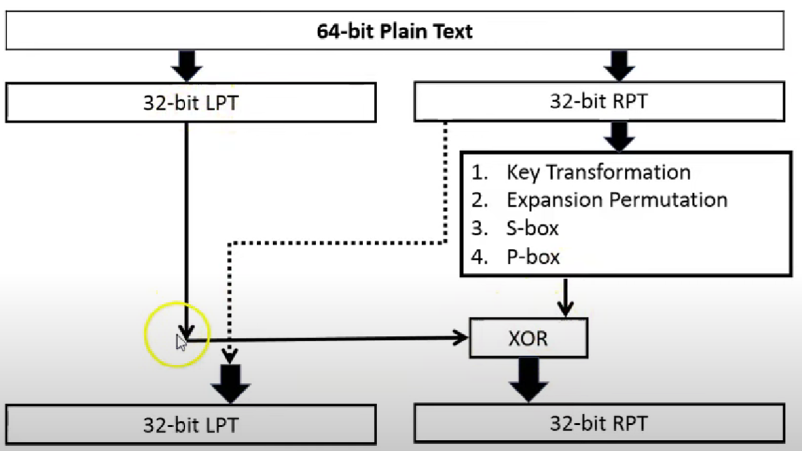

# DES_Keamanan Informasi

| Nama | NRP |
|------------------------|------------|
|Syarifah Talitha Erfany | 5025211175 |

## Daftar Isi
- [Opening](#opening)
- [Code](#Code)
- [Server](#server)
- [Client](#client)
- [Reference](#Reference)

## Opening


ada 2 input, yaitu 56-bit key dan 64-bit plain text

### Key Discarding Process


Setiap bit ke 8 dari original key itu bakal dihapuskan dan itu akan menghasilkan 56-bit key

### Steps of DES


1. 64-bit plain text diberikan ke inisial permutasi (IP)


Bit ke 58 dari original plaintext block bakal menulis ulang isi dari block pertama posisi bit

Bit ke 1 dari original plaintext bakal menulis ulang isi dari block 40 posisi bit

2. IP terbagi 2 blok permutasi menjadi Left Plain Text (LPT) dan Right Plain Text (RPT)
3. LPT dsn RPT akan menghasilkan 16-round proses enkripsi
4. LPT dan RPT akan bergabung kembali dan menghasilkan blok yang tergabung
5. 64-bit cipher text blok telah tergenerasi

### 16 Rounds of Encryption

1. **Key transformation (56-bit key)**
- tiap key dipecah jadi 2, masing-masing 28-bits 
- Shifting posisi bit itu tergantung dari round-nya


- Compression Permutation
    - 56-bit input dengan shifting posisi bit
    - Menghasilkan 48-bit key


2. **Expansion Permutation dari plain text dan XOR**
- 32-bit RPT di expand jadi 48-bit karena bit yang lain 48-bit
- Steps :
    - 32-bit RPT dibagi menjadi 8-block yang masing-masing berisi 4-bit


    - Lalu setiap 4-bit block diexpand lagi menjadi 6-bit tiap block

    
    - 48-bit RPT di XORkan dengan 48-bit key dan outputnya diberikan ke S-box


3. **S-box substitution**
- Mengconvert lagi dari 48-bit RPT jadi 32-bit karena LPT nya masih 32-bit
- Steps :
    - Misalkan hasil dari XOR adalah 011011, karena diambil 4-bit di tengah sehingga fokus di 1001, sedangkan 2-bit di depan dan belakang menyatu


4. **P-box (permutation)**
- Output dari S-box itu dikasih ke P-box
- 32-bit dipermutasikan dengan 16 x 2 tabel permutasi


5. **XOR dan swap**
- 32-bit LPT di XOR dengan 32-bit P-box


Round pertama sudah selesai

6. **Final Permutation**
- FP hanya terjadi sekali setelah 16 round
- Outputnya adalah 64-bit block yang telah di enkripsi

## Code
```
def hex2bin(s):
	mp = {'0': "0000",
		'1': "0001",
		'2': "0010",
		'3': "0011",
		'4': "0100",
		'5': "0101",
		'6': "0110",
		'7': "0111",
		'8': "1000",
		'9': "1001",
		'A': "1010",
		'B': "1011",
		'C': "1100",
		'D': "1101",
		'E': "1110",
		'F': "1111"}
	bin = ""
	for i in range(len(s)):
		bin = bin + mp[s[i]]
	return bin
```
Dibuat fungsi library `hex2bin` dengan parameter `s` yang berguna untuk ngeconvert hexadesimal menjadi binary


---

```
def bin2hex(s):
	mp = {"0000": '0',
		"0001": '1',
		"0010": '2',
		"0011": '3',
		"0100": '4',
		"0101": '5',
		"0110": '6',
		"0111": '7',
		"1000": '8',
		"1001": '9',
		"1010": 'A',
		"1011": 'B',
		"1100": 'C',
		"1101": 'D',
		"1110": 'E',
		"1111": 'F'}
	hex = ""
	for i in range(0, len(s), 4):
		ch = ""
		ch = ch + s[i]
		ch = ch + s[i + 1]
		ch = ch + s[i + 2]
		ch = ch + s[i + 3]
		hex = hex + mp[ch]

	return hex
```
Dibuat fungsi library `bin2hex` dengan parameter `s` yang berguna untuk ngeconvert binary menjadi hexadesimal

---

```
def bin2dec(binary):

	binary1 = binary
	decimal, i, n = 0, 0, 0
	while(binary != 0):
		dec = binary % 10
		decimal = decimal + dec * pow(2, i)
		binary = binary//10
		i += 1
	return decimal
```
Fungsi `bin2dec` dengan parameter `binary` untuk mengubah dari binary ke desimal

`binary1` menyimpan salinan dari `binary` karena nilainya akan terus diubah selama proses konversi

---

```
def dec2bin(num):
	res = bin(num).replace("0b", "")
	if(len(res) % 4 != 0):
		div = len(res) / 4
		div = int(div)
		counter = (4 * (div + 1)) - len(res)
		for i in range(0, counter):
			res = '0' + res
	return res
```
Fungsi `dec2bin` dengan parameter `num` untuk mengubah dari desimal ke binary

`res = bin(num).replace("0b", ""):`

Fungsi `bin(num)` mengonversi bilangan desimal `num` ke representasi binernya

`Metode replace("0b", "")` digunakan untuk menghapus awalan "0b" yang muncul dalam representasi biner yang dihasilkan oleh fungsi `bin()`.

`if(len(res) % 4 != 0):` = mengecek apakah panjang string binernya tidak habis dibagi oleh 4

`counter = (4 * (div + 1)) - len(res)` = selisih antara panjang string biner setelah penambahan digit 0 dan panjang string biner awal (sebelum penambahan digit 0)

---

```
def permute(k, arr, n):
	permutation = ""
	for i in range(0, n):
		permutation = permutation + k[arr[i] - 1]
	return permutation
```
Fungsi `permute` dengan parameter `k` sebagai input, `arr` sebagai urutan permutasi, dan `n` sebagai panjang array untuk menghitung permutasi

`k[arr[i] - 1]` = melakukan permutasi pada input `k`
`[arr[i] - 1]`  digunakan karena indeks dalam pemrograman dimulai dari 0, sedangkan dalam konteks permutasi, indeks dimulai dari 1.

---

```
def shift_left(k, nth_shifts):
	s = ""
	for i in range(nth_shifts):
		for j in range(1, len(k)):
			s = s + k[j]
		s = s + k[0]
		k = s
		s = ""
	return k
```
Fungsi `shift_left` dengan parameter `k` sebagai input yang akan di shift ke kiri dan `n` sebagai jumlah berapa kali shift ke kiri akan dilakukan

Karakter pertama dari string input awal `(k[0])` ditambahkan ke `s` untuk menyelesaikan shift ke kiri

---

```
def xor(a, b):
	ans = ""
	for i in range(len(a)):
		if a[i] == b[i]:
			ans = ans + "0"
		else:
			ans = ans + "1"
	return ans
```
Fungsi `xor` dengan parameter `a` dan `b` yang akan dibandingkan

---

```
def encrypt(pt, rkb, rk):
	pt = hex2bin(pt)

	# Initial Permutation
	pt = permute(pt, initial_perm, 64)
	print("After initial permutation", bin2hex(pt))

	# Splitting
	left = pt[0:32]
	right = pt[32:64]
	for i in range(0, 16):
		# Expansion D-box: Expanding the 32 bits data into 48 bits
		right_expanded = permute(right, exp_d, 48)

		# XOR RoundKey[i] and right_expanded
		xor_x = xor(right_expanded, rkb[i])

		# S-box: substituting the value from s-box table by calculating row and column
		sbox_str = ""
		for j in range(0, 8):
			row = bin2dec(int(xor_x[j * 6] + xor_x[j * 6 + 5]))
			col = bin2dec(
				int(xor_x[j * 6 + 1] + xor_x[j * 6 + 2] + xor_x[j * 6 + 3] + xor_x[j * 6 + 4]))
			val = sbox[j][row][col]
			sbox_str = sbox_str + dec2bin(val)

		# Straight D-box: After substituting rearranging the bits
		sbox_str = permute(sbox_str, per, 32)

		# XOR left and sbox_str
		result = xor(left, sbox_str)
		left = result

		# Swapper
		if(i != 15):
			left, right = right, left
		print("Round ", i + 1, " ", bin2hex(left),
			" ", bin2hex(right), " ", rk[i])

	# Combination
	combine = left + right

	# Final permutation: final rearranging of bits to get cipher text
	cipher_text = permute(combine, final_perm, 64)
	return cipher_text
```

Fungsi `encrypt` melakukan konversi plaintext ke biner dan initial permutation, iterasi 16 round, dan kombinasi & final permutation

> S-box 

`for j in range(0, 8):` ada 8 S-box yang masing-masing mengonversi 6-bit input jadi 4-bit output

`row = bin2dec(int(xor_x[j * 6] + xor_x[j * 6 + 5]))` mengambil 2-bit pertama (indeks 0 dan 5) dari input 6-bit

`col = bin2dec(int(xor_x[j * 6 + 1] + xor_x[j * 6 + 2] + xor_x[j * 6 + 3] + xor_x[j * 6 + 4]))` mengambil 4-bit berikutnya (indeks 1 - 4) dari input 6 bit

> Swapper

`print("Round ", i + 1, " ", bin2hex(left), " ", bin2hex(right), " ", rk[i])` mencetak informasi round, nilai blok kiri, nilai blok kanan, dan nilai subkunci (round key)

---

```
rkb = []
rk = []
for i in range(0, 16):
	# Shifting the bits by nth shifts by checking from shift table
	left = shift_left(left, shift_table[i])
	right = shift_left(right, shift_table[i])

	# Combination of left and right string
	combine_str = left + right

	# Compression of key from 56 to 48 bits
	round_key = permute(combine_str, key_comp, 48)

	rkb.append(round_key)
	rk.append(bin2hex(round_key))
```
`rkb` untuk menyimpan subkunci biner 48-bit dan `rk` menyimpan dalam format heksadesimal selama proses iterasi

```
left = shift_left(left, shift_table[i])
right = shift_left(right, shift_table[i])
```
`shift_left` untuk melakukan penggeseran ke kiri dan penggeseran itu sejumlah langkah yang telah ditentukan oleh `shift_table[i]`

## Reference

https://www.geeksforgeeks.org/data-encryption-standard-des-set-1/

https://byjus.com/maths/convert-hexadecimal-to-binary/

https://www.youtube.com/watch?v=cVhlCzmb-v0&ab_channel=ChiragBhalodia

https://www.tutorialspoint.com/what-is-initial-permutation-in-des

https://www.rapidtables.com/convert/number/binary-to-decimal.html

https://www.cs.cornell.edu/courses/cs100/2000sp/p7/node11.html#:~:text=Why%20the%20term%20inverse%3F,you%20produce%20the%20original%20plaintext.